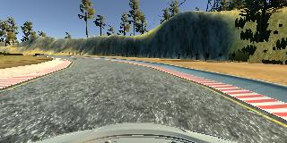
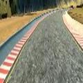

# **Behavioral Cloning** 


---

**Behavioral Cloning Project**

The goals / steps of this project are the following:

* Use the simulator to collect data of good driving behavior
* Build, a convolution neural network in Keras that predicts steering angles from images
* Train and validate the model with a training and validation set
* Test that the model successfully drives around track one without leaving the road
* Summarize the results with a written report


---
### Files Submitted & Code Quality

#### 1. Submission includes all required files and can be used to run the simulator in autonomous mode

My project includes the following files:
* model.py containing the script to create and train the model
* drive.py for driving the car in autonomous mode
* model.h5 containing a trained convolution neural network 
* writeup_report.md or writeup_report.pdf summarizing the results

#### 2. Running the model
Using the Udacity provided simulator and my drive.py file, the car can be driven autonomously around the track by executing 
```
python drive.py model.h5
```

#### 3. Training 

The model.py file contains the code for training and saving the convolution neural network. The file shows the pipeline I used for training and validating the model, and it contains comments to explain how the code works.

### Model Architecture and Training Strategy

####  1. Model Architecture

I tried several models from published papers. Initially, I started with the nvidia model followed by the comma.ai model. They both performed well but I found myself overfitting fairly quickly. I finally settled on a custom model based on the commai structure but deeper. It is 4 convolutional layers with filters in a base2 multiple for tensorflow training optimization. Following the conv layers are 3 fully connected layers and an output layer. 

#### 2. Attempts to reduce overfitting in the model

The model contains sever dropout layers in order to reduce overfitting as well as normalization in the input.

#### 3. Model parameter tuning

I used on adam optimizer with a fairly small initial learning rate.

#### 4. Appropriate training data

I initially was overfitting to my training data so I had to return to the simulator and collect more general lap data. After training, I was able to find more niche failure zones and collect data recovering from those failure states or simply driving the section correctly. I found the using the keyboard arrows caused the training data to be too extreme and had much better success with the trackpad.

### Model Architecture and Training Strategy

#### 1. Solution Design Approach

My first step was to split the data into training/validation/test sets with a 0.6/0.2/0.2 split respectively. I then implemented the nvidia and comma.ai models. With comma.ai, I wasn't seeing an improvement in training/validation accuracy after a short time and it didn't seem to improve with more data. I figured that I'd likely see better results with a deeper model. With nVidia's model, I found that I was overfitting until I had more data. Ultimately, I found that using a deeper version of comma.ai's model with Dropout and input normalization offered me the best results.

#### 2. Final Model Architecture

The final model architecture consisted of four conv net layers and 3 fully connected layers with an output layer. The 4 convolutional layers have filters in a base2 multiple for tensorflow training optimization. The fully connected layers gradually decrease in size until reaching the output layer. I included dropouts in the training to avoid overfitting. As well, I used ELU activation layer for most hidden layers to add non-linearity and to combat vanishing gradient. An advantage of ELU over RELU is that the mean of the activation function is closer to zero which can prompt faster learning.

#### 3. Creation of the Training Set & Training Process

To capture good driving behavior, I first recorded several laps of good center lane driving followed by some recovery scenes. 



After collecting the inital laps, I found that I needed much more data and doubled my dataset. 

With the increase in data, I was able to find more niche problem areas and record recovery scenes. As well, I was able to augment my turn data by horizontally flipping the scenes. Before I feed the imagery into the model, I crop all of the images so that the scene is mostly just road.



After the collection and augmentation process, I had 43,467 data points. I randomly shuffled the data and split the data as 60% train/ 20% validation/ 20% test.

I used this training data for training the model. The validation set helped determine if the model was over or under fitting. The ideal number of epochs was 100. 

My final video is [here](final.mp4) and I wasn't able to upload my final model to github due to size constraints but it is stored on dropbox [here](https://www.dropbox.com/s/tliozs68svsc95l/model.h5?dl=0)
